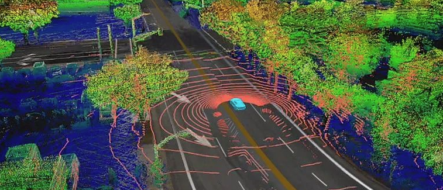

# Hi, I'm Johnson Wu 👋

> Industrial Navigation (SD/HD) Map engineer turned educator.
> Documenting 20+ years of navigation map industry experience
> through open-source code and a forthcoming textbook.

## Who I Am

- 🏢 **Autonomous Driving Mapping** engineer (Toronto)
- 🌍 **NDS Association China Contributor** since 2008 (15+ years)
- 📘 **Author** of *《导航电子地图原理》*
  *(Principles of Navigation Maps,*
  *Wuhan University Press, 2027, published as Zhongheng Wu)*
- 🛣️ **20+ years** across navigation map industry

## Career Highlights

- 🚗 **Pioneered the world's first NDS-format automotive navigation database**
  — deployed in BMW 7 Series, Volkswagen, Daimler
- 🛣️ **Shipped production HD Map for GM Super Cruise™**
  — end-to-end pipeline, ECU-side software
- 🌐 **Delivered map systems across 5 countries, 3 continents**
  (China · Netherlands · Singapore · Canada · USA)
- 📜 **11 publications · 18 patents · National S&T Progress Award** (1st-class, MoE)
- 🎓 **MSc GIS**, Wuhan University

*Full résumé on [LinkedIn](https://linkedin.com/in/wu-johnson/)*

## What I'm Building

> **NavMap Lab** — *Where industrial practice meets open-source education.*

Sharing industrial navigation map know-how through
open-source notebooks, tutorials, and tooling.

### Coming Soon

- 📓 `nav-map-tutorial` — Hands-on companion to my textbook
  (Python + OpenStreetMap + Jupyter)
- 📘 Errata + supplementary resources (launching with the book, 2027)

## Connect

- 💼 [LinkedIn](https://linkedin.com/in/wu-johnson/) (Johnson Wu)
- 🎓 [Google Scholar](https://scholar.google.com/citations?user=8Zt6nbMAAAAJ) (11 publications)
- 📚 [CSDN Blog](https://blog.csdn.net/keykeywu)
- 📍 Toronto, Canada

---
*Johnson Wu (Zhongheng Wu) · 20+ years in nav map industry*
